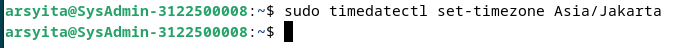
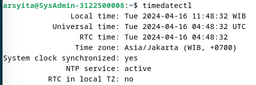
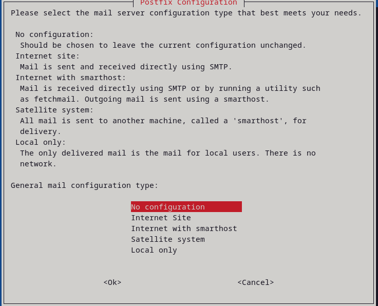
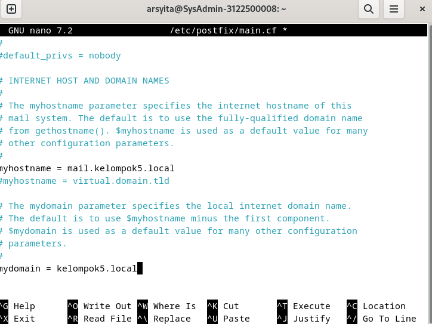

 <h1 align="Center">LAPORAN WORKSHOP ADMINISTRASI JARINGAN</h1>


<p align="center">
  
</p>

<h4 align="Center">Anggota Kelompok 5</h4>

<p align="center">
Arsyita Devanaya Arianto (3122500008) <br>
</p>

<br>
<h4 align="center">
PROGRAM STUDI VOKASI <br>
D-III TEKNIK INFORMATIKA <br>
DEPARTEMEN TEKNIK INFORMATIKA DAN KOMPUTER 
POLITEKNIK ELEKTRONIKA NEGERI SURABAYA <br> 
2023
</h4> <br><br><hr>

# WEB EMAIL SYSTEM

## Persiapan server
   

## NTP Client
1. Lakukan instalasi paket layanan sinkronisasi waktu
   
2. Lakukan konfigurasi timezone ke Asia/Jakarta
   
3. Lakukan konfigurasi Real Time Clock(RTC)
   
4. Aktifkan NTP client untuk sinkronisasi waktu
   
5. Menyunting file timesyncd.conf untuk mengarah ke NTP server terdekat untuk mendapatkan waktu delay terpendek
   
6. Restart layanan sinkronisasi dan cek status
   
   
7. Cek kesesuaian tanggal
   

## Install Web Server (Apache2 + PHP-FM)
1. Install apache 2
   ```
   sudo apt -y install apache2
   ```
2. Lakukan konfigurasi Apache2
   ```
   sudo nano /etc/apache2/conf-enabled/security.conf
   ```
   
    ```
   sudo nano /etc/apache2/mods-enabled/dir.conf
   ```
   
   ```
   sudo nano /etc/apache2/apache2.conf
   ```
   
   ```
   sudo nano /etc/apache2/sites-enabled/000-default.conf
   ```
   
   ```
   systemctl reload apache2
   ```
   
3. Test ke web browser
   

## Install PHP 8.2
1. Lakukan penginstalan
   
2. Mengecek versi php dan test
   
   

## Install PHP-FM
1. Lakukan penginstalan
   
2. Konfifurasi PHP-FM pada file konfigurasi Apache
   
3. Test validasi PHP-FM degan membuat file info.php di root document
   
4. Lakukan test di browser
   

# Database System : MariaDB
1. Lakukan penginstalan
   
2. Lakukan konfigurasi
   
3. Lakukan restart mariadb
   
4. Inisialisasi konfigurasi dan testing database mariadb
   ```
   sudo mysql_secure_installation
   ```
   
   ```
   sudo mysql
   ```
   
   ```
   show grants for root@localhost;
   ```
   
   ```
   select user,host,password from mysql.user; 
   ```
   
   ```
   show databases; 
   ```
   
   ```
   create database test_database;
   ```
   
   ```
   create table test_database.test_table (id int, name varchar(50), address varchar(50), primary key (id)); 
   ```
   
   ```
    insert into test_database.test_table(id, name, address) values("001", "Debian", "Hiroshima"); 
   ```
   
   ```
    select * from test_database.test_table;
   ```
   
   ```
    drop database test_database; 
   ```
   

## Melakukan Install PHPMYADMIN
1. Lakukan penginstalan
   ```
    sudo apt install phpmyadmin
   ```
2. Pilih apache2 sebagai web server
   
3. Pilih ya untuk konfigurasi database phpmyadmin
   
4. Masukkan password
   
   
5. Create Apache Configuration for phpMyAdmin
   ```
    sudo nano /etc/apache2/apache2.conf
   ```
   
6. Membuka phpmyadmin di browser
   
   
7. Menambahkan prifilage ke user phpmyadmin
   - Login ke mariadb
   - Masukkan perintah GRANT ALL PRIVILEGES ON *.* TO 'phpmyadmin'@'localhost' IDENTIFIED BY 'password' WITH GRANT OPTION; FLUSH PRIVILEGES;
   
   

## Melakukan install email system
1. Lakukan penginstalan
   ```
    sudo apt -y install postfix sasl2-bin
   ```
2. Pilih no konfigurasi
   
3. Buat salinn file konfigurasi default
   ```
    sudo cp /usr/share/postfix/main.cf.dist /etc/postfix/main.cf
   ```
   
4. Edit konfigurasi
   ```
    sudo nano /etc/postfix/main.cf
   ```
   
5. Perbarui database alias
   ```
    sudo newaliases
   ```
   
6. Lakukan restart postfix
   ```
    systemctl restart postfix
   ```
   

## Menambahkan knfigurasi anti spam
1. Lakukan edit file main.cf
   
2. Restart postfix
   

## DOVECOT : IMAP4 (TCP 143) and POP3 (TCP110) Server
1. Lakukan instal Devecot Server
   ```
    sudo apt -y install dovecot-core dovecot-pop3d dovecot-imapd
   ```
2. Edit file defecot.conf
   ```
    sudo nano /etc/dovecot/dovecot.conf
   ```
   
3. Edit file 10-auth.conf
   ```
    sudo nano /etc/dovecot/conf.d/10-auth.conf
   ```
   
   
4. Edit file 10-mail.conf
   ```
    sudo nano /etc/dovecot/conf.d/10-mail.conf
   ```
   
5. Edit file 10-master.conf
   ```
    sudo nano /etc/dovecot/conf.d/10-master.conf
   ```
   
6. Restart devecot
   ```
    sudo systemctl restart dovecot
   ```

## Final Check semua servis
1. Menampilkan semua koneksi jaringan
   ```
    netstat -a| grep LISTEN
   ```
   
2. Cek layanan posfix
   ```
    telnet mail.kelompok6.local 25
   ```
   

## Install webmail (RoundCube)
1. Configure SSL/TLS settings on Apache2 Server, refer to here. 
   
   
2. Buat database untuk RoundCube
   ```
    sudo mysql -u root -p
   ```
   
3. Install dan konfigurasi RoundCube
   ```
    sudo apt -y install roundcube roundcube-mysql
   ```
   
   
4. Berpindah direktori
   ```
    cd /usr/share/dbconfig-common/data/roundcube/install
   ```
5. Jalankan perintah dan masukkan password
   ```
    sudo mysql -u roundcube -D roundcube -p < mysql
   ```
6. Lakukan edit pada file debian-db.php
   ```
    sudo nano /etc/roundcube/debian-db.php
   ```
   
7. Lakukan edit pada file config.inc.php
   ```
    sudo nano /etc/roundcube/config.inc.php
   ```
   
   
8. Lakukan edit pada file roundcube.conf
   ```
    sudo nano /etc/apache2/conf-enabled/roundcube.conf
   ```
   
9.  Lakukan restart apache2
    ```
    sudo systemctl restart apache2
   ```

## Install Thunderbird (Email GUI Client)
1. Lakukan penginstalan
   ```
    flatpak install flathub org.mozilla.Thunderbird
   ```
2. install thunderbird GUI on https://flathub.org/apps/org.mozilla.Thunderbird
   
3. Menambahkan 2 email
   
4. Coba saling sand email
   
   
   
   
   