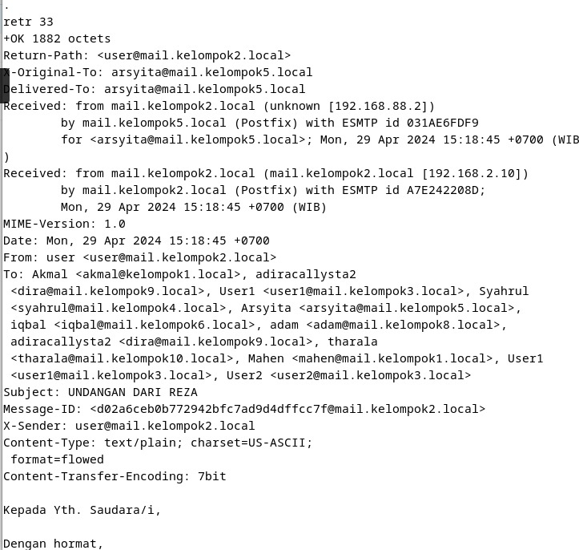
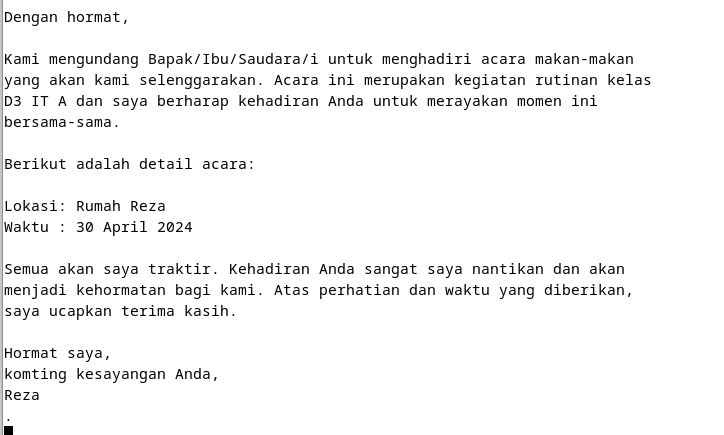
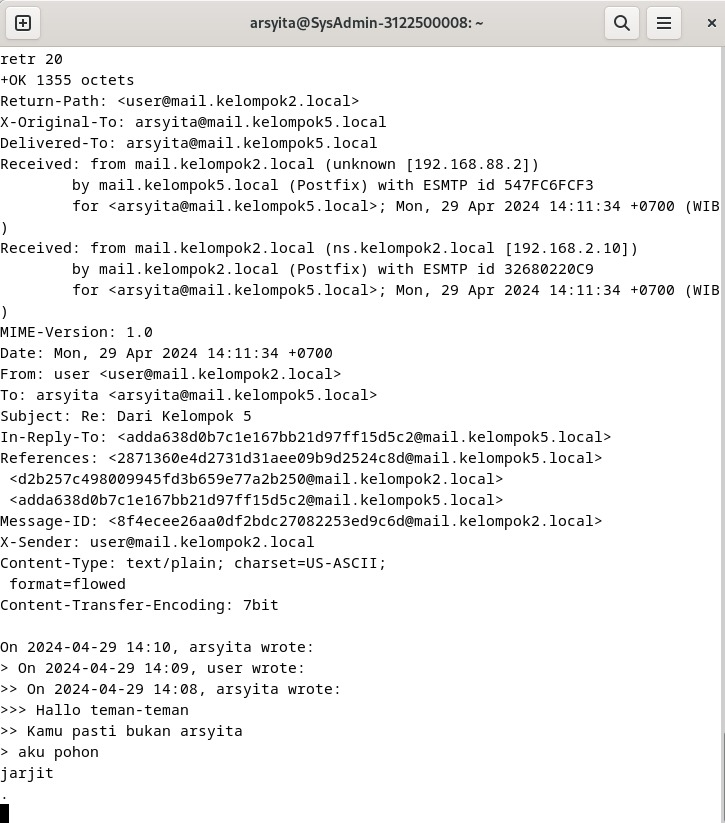

## Melanjutkan Tugas 5 (SMTP, POP3, dan MIME)
### SMTP

> Pengiriman email dari client (device lainnya)

Simple Mail Transfer Protocol (SMTP) adalah sebuah protokol standar untuk mengirim email di internet. SMTP biasa bekerja ketika mengirim email dari email client ke email server lain atau dari satu email server ke email server lainnya.
Dari praktek di atas, kami menghubungkan ke IP 192.168.5.10 melalui protokol telnet dengan port 25. Port 25 merupakan port non-enkripsi default SMTP. Dengan perintah tersebut, kami menghubungkan ke server email yang mungkin berjalan di alamat IP tersebut.

- `ehlo mail.kelompok5.local` untuk mengkoneksikan ke server email dibuat.
- `mail from` untuk menentukan alamat email pengirim.
- `rcpt to` untuk menentukan alamat email penerima.

### POP3

Post Office Protocol version 3 atau POP3 adalah sebuah protokol email standard yang digunakan untuk menerima email dari sebuah server email ke email client yang digunakan. Dengan POP3, kita dapat mendownload pesan-pesan yang ada pada server email ke komputer atau device dan bisa membacanya bahkan ketika komputer offline atau tidak terkoneksi dengan internet. Jika menggunakan POP3 untuk berhubungan dengan akun email, email-email kita akan didownload ke device lokal dan dihapus dari server email kita. Jadi, jika ingin bisa mengakses email dari beberapa aplikasi yang berbeda, POP3 bukanlah pilihan yang tepat.
Dari praktek di atas, kami menghubungkan ke IP 192.168.5.10 melalui protokol telnet dengan port 110. Port 110 merupakan port non-enkripsi default POP3.

- `user arsyita` untuk melakukan login/masuk sebagai arsyita.
- `pass Surabaya24` untuk memasukkan password.
- `list` untuk melihat jumlah daftar pesan email yang diterima.
- `retr 33` untuk melihat dan membuka pesan email dari salah satu email yang diterima sesuai dengan nomor urutannya.

### MIME

Analisa header MIME
Return-Path digunakan untuk menentukan alamat email yang akan menerima laporan undelivered dari sistem email.
X-Original-To untuk memberikan informasi tentang alamat tujuan asli dari pesan tersebut sebelum proses pengiriman lanjutan.
Delivered-To untuk menunjukkan alamat email tujuan di level pengiriman yang paling terakhir.
Received untuk mencatat informasi seperti waktu, alamat IP, dan nama host server yang memproses pesan tersebut.
MIME-Version untuk melihat versi MIME yang digunakan dalam pesan mail ini
Date untuk memberikan informasi tanggal dan waktu pesan dikirm
From berisi alamat mail pengirim pesan
To berisi alamat mail penerima pesan
Subject merupakan subject atau topik dari suatu pesan
User-Agent untuk memberikan informasi tentang klien email atau perangkat lunak yang digunakan oleh pengirim kepada penerima.
Message-ID seperti nomor id (identitas) dari pesan, dan biasanya unik.
X-Sender untuk memberikan informasi tambahan tentang identitas pengirim pesan kepada penerima.
Content-Type berisi tipe konten yang terdapat dalam pesan tersebut.

Fungsi dari Content-Type adalah:
Menentukan Jenis Konten: menyatakan jenis konten yang terdapat dalam bagian pesan tertentu, seperti teks biasa, HTML, gambar, lampiran, audio, atau video. Sehingga, klien email mengetahui cara menangani dan menampilkan konten pesan dengan benar.
Menentukan Pengaturan Karakter: seperti UTF-8 atau ISO-8859-1. Ini penting untuk memastikan bahwa karakter dalam pesan ditampilkan dengan benar, terutama jika pesan mengandung teks dalam bahasa dengan karakteristik khusus.
Mendukung Lampiran: Jika pesan mengandung lampiran, "Content-Type" memberikan informasi tentang jenis konten lampiran tersebut (misalnya, PDF, gambar JPEG, dokumen Word, dll.).
Mendukung Format Konten: Misalnya, jika pesan mengandung bagian teks biasa dan bagian HTML, "Content-Type" akan menentukan tipe konten untuk masing-masing bagian, tergantung pada preferensi pengguna atau kemampuan klien.

Penjelasan MIME
Multipurpose Internet Mail Extensions atau MIME Type adalah standar internet yang menjelaskan konten file internet berdasarkan sifat dan format dokumen, file, atau kumpulan byte yang membantu browser membuka file dengan ekstensi atau plugin yang sesuai. Ini didefinisikan dan distandarisasi dalam IETF's RFC 6838.

Tipe MIME berisi dua bagian, yaitu.
1. Type, menjelaskan kategorisasi tipe MIME yang ditautkan satu sama lain.
Subtype, unik untuk tipe file tertentu yang merupakan bagian dari tipe.
1. Browser menggunakan jenis MIME, bukan ekstensi file, untuk menentukan cara memproses URL, sehingga web server harus mengirimkan jenis MIME yang benar di header jenis konten respons. Jika ini tidak dikonfigurasi dengan benar, browser mungkin salah menafsirkan konten file dan situs tidak akan bekerja dengan benar, dan file yang diunduh mungkin salah dalam penanganan.

#### Struktur  MIME type
Tipe MIME yang paling sederhana terdiri dari satu tipe dan subtipe. Setiap string yang jika digabungkan dengan garis miring (/) di antaranya, akan membentuk tipe MIME. Tidak ada spasi yang diizinkan dalam tipe MIME:

type/subtype
Type tersebut mewakili kategori umum tempat tipe data berada, seperti video atau teks. Subtype mengidentifikasi jenis data yang tepat dari jenis tertentu yang diwakili oleh jenis MIME. Misalnya, untuk teks jenis MIME, subjenisnya mungkin file biasa (teks biasa), html (kode sumber HTML), atau kalender (untuk iCalendar / .ics). Setiap tipe memiliki kumpulan subtipe yang memungkinkan, dan tipe MIME selalu memiliki tipe dan subtipe, tidak pernah hanya satu atau yang lain.

Parameter opsional dapat ditambahkan untuk memberikan detail tambahan:
type/subtype;parameter=value
Misalnya, untuk semua tipe MIME yang jenis utamanya adalah teks, parameter opsional charset untuk menentukan rangkaian karakter yang digunakan (karakter dalam data). Jika tidak, defaultnya adalah ASCII (US-ASCII) kecuali diganti oleh pengaturan agen pengguna. Untuk menentukan file teks UTF-8, tipe MIME text/plain; charset = UTF-8 digunakan.

#### Jenis-Jenis MIME Type
Ada dua kelas tipe: discrete dan multipart. Jenis diskrit adalah jenis yang mewakili satu file atau media, seperti satu teks atau file musik, atau video. Jenis multipart adalah salah satu yang mewakili dokumen yang terdiri dari beberapa bagian komponen, yang masing-masing mungkin memiliki jenis MIME tersendiri; atau, tipe multipart dapat merangkum banyak file yang dikirim bersama dalam satu transaksi. Misalnya, tipe MIME multipart digunakan saat melampirkan banyak file ke email.

Dengan pengecualian multipart/form-data, digunakan dalam metode POST pada HTML Forms, dan multipart/byteranges, digunakan dengan 206 Partial Content untuk mengirim bagian dari dokumen, HTTP tidak menangani dokumen multipart dengan cara khusus: pesan ditransmisikan ke browser.

