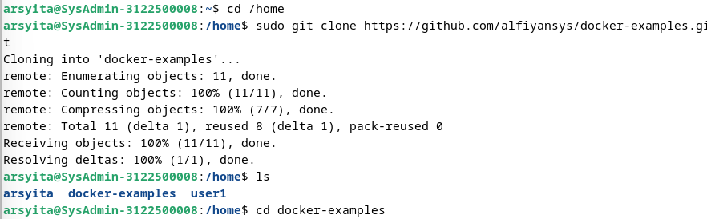
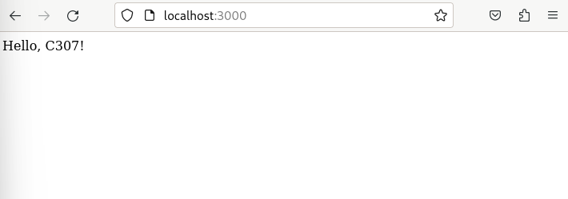

  <h1 align="Center">LAPORAN WORKSHOP ADMINISTRASI JARINGAN</h1>


<p align="center">
  
</p>

<h4 align="Center">Anggota Kelompok 5</h4>

<p align="center">
1. Arsyita Devanaya Arianto (3122500008) <br>
2. Mirta Chadhirotin Nachlah (3122500009) <br>
3. Shofira Izza Nurrohmah (3122500026)
</p>

<br>
<h4 align="center">
PROGRAM STUDI VOKASI <br>
D-III TEKNIK INFORMATIKA <br>
DEPARTEMEN TEKNIK INFORMATIKA DAN KOMPUTER 
POLITEKNIK ELEKTRONIKA NEGERI SURABAYA <br> 
2023
</h4> <br><br><hr>

# Arsitektur web browser dan web server


**Pengertian Web Server & Web Client**   
   Web client dan Web server berkomunikasi menggunakan protokol HTTP (HyperText Transfer Protocol). Web client adalah komputer yang tergabung dalam jaringan atauinternet yang meminta informasi. Untuk dapat mengakses web server, web client menggunakan aplikasi yang disebut Web browser. Web server adalah komputer yang tergabung dalam jaringan atau internet yang memberikan informasi.

**Fungsi Web Server & Web Client**  
- Fungsi Client :
Client Fungsi utama Client adalah menghasilkan permintaan untuk berbagai layanan yang bersumber dari server. Client juga dapat dinonaktifkan sewaktu-waktu. Contoh klien adalah smartphone, desktop, laptop, dan lainnya.
- Fungsi Web Server :
    - Mentransfer data yang diminta user
Biasanya, sebuah laman web terdiri dari berbagai macam informasi dalam berbagai bentuk, seperti teks, video, gambar, audio, atau dokumen. Berkas-berkas inilah yang nantinya akan dikirimkan ke browser-mu sesuai permintaan. Pada praktiknya langsung, web server akan merespon permintaan yang kamu tulis di address bar dan informasi yang kamu minta tadi akan ditampilkan ke browser-mu. Jika permintaanmu tidak bisa dicari, maka web server akan melakukan pengiriman balik berupa penolakan dengan cara memberikan informasi yang biasa dikenal dengan kode ‘404’, artinya kata kunci yang kamu cari tidak bisa ditemukan.
    - Memeriksa keamanan dari permintaan HTTP
Selain itu, web server berfungsi untuk memeriksa sistem keamanan dari request HTTP
yang diminta oleh klien atau web browser. Web server menggunakan HTTP/HTTPS
sebagai perantara untuk menghubungkan website dengan web server. Proses transfer
data yang dilakukan bersifat privat dan tidak bisa diakses sembarangan oleh publik.


**Cara kerja Web Server**

    <br>

1. Client melakukan permintaan untuk mengakses sebuah domain Uniform Resource Locator (URL) yang diketikkan pada address bar di sebuah browser
2. Permintaan tersebut dikirim ke server penyedia DNS.
3. Bila halaman web tersebut menggunakan database programming, maka akan dihubungkan dengan database server
4. Apabila domain pada URL tersebut ada di web server, maka web server akan segera melakukan respon, dengan menampilkan web yang diinginkan.
5. Apabila domain pada URL tersebut tidak ada, maka akan muncul informasi "Page Not Found" artinya halaman tidak ditemukan.
6. Pengiriman permintaan web dari client tersebut akan didelegasikan melalui DNS server.
7. Demikian seterusnya, karena setiap perangkat terhubung ke internet dan memiliki spesifikasi yang baik, juga dengan koneksi internet yang cukup, maka proses permintaan web tidak akan berlangsung lama.


**Cara kerja Web Client**

    <br>

1. Client dapat membangun sebuah halaman web berdasarkan database yang dimiliki, dengan menggunakan perangkat keras (hardware) dan software. Sehingga, menghasilkan tampilan atau UI tertentu. 
2. Server dapat mempengaruhi UI. Server web menerima permintaan dan menyimpan UI web tersebut berupa dokumen HTML. 
3. Client yang meminta akses informasi, dalam hal ini adalah pengguna, maka server akan mengirimkan dokumen HTML tersebut. Hasilnya informasi tampil di browser dan kamu dapat membacanya dengan tampilan UI yang menarik dan mudah dimengerti. 
4. Ketika client (pengguna) sudah mendapatkan informasinya, maka client akan memeriksa kode program atau sintaks. Proses ini menghasilkan database yang diperlukan. Proses ini menggunakan bahasa pemrograman SQL atau sejenisnya. 
5. Proses tersebut diteruskan ke server, sambil menunggu server mendapat respons dari pengguna akhir. Ketika pengguna merespons, permintaan database dibuat untuk client dan hasilnya tayang di layar kamu. 

#### Menginstal Docker
1. Uninstall conflicted
   ```
      for pkg in docker.io docker-doc docker-compose podman-docker containerd runc; do sudo apt-get remove $pkg; done
   ```
   Perintah tersebut adalah sebuah loop Bash yang menghapus beberapa paket dari sistem menggunakan manajer paket apt-get. Paket-paket yang dihapus termasuk docker.io, docker-doc, docker-compose, podman-docker, containerd, dan runc. 

2. Install docker engine
   
   `` Menambahkan Kunci GPG resmi Docker ``
   ```
      sudo apt-get update sudo apt-get install ca-certificates curl sudo install -m 0755 -d /etc/apt/keyrings sudo curl -fsSL https://download.docker.com/linux/debian/gpg -o /etc/apt/keyrings/docker.asc sudo chmod a+r /etc/apt/keyrings/docker.asc
   ```
   
   
   ket: 
   Langkah-langkah untuk menambahkan kunci GPG resmi Docker meliputi memperbarui daftar paket Apt, menginstal paket ca-certificates dan curl untuk keamanan, membuat direktori baru di /etc/apt/keyrings untuk menyimpan kunci GPG, mengunduh kunci GPG resmi Docker, dan memberikan izin baca untuk kunci tersebut. Langkah-langkah ini memastikan sistem memiliki akses yang diperlukan untuk mengotentikasi paket-paket Docker yang diunduh dari repositori Docker.

   `` Menambahkan Repository Docker ke Sumber APT ``
   ```
      echo \  
      "deb [arch=$(dpkg --print-architecture) signed-by=/etc/apt/keyrings/docker.asc] https://download.docker.com/linux/debian \
      $(. /etc/os-release && echo "$VERSION_CODENAME") stable" | \
      sudo tee /etc/apt/sources.list.d/docker.list > /dev/null sudo apt-get update
   ```
   
   ket:
   Perintah echo "..." digunakan untuk menciptakan teks yang mendefinisikan repositori Docker, dengan %VERSION_CODENAME% menghasilkan kode nama versi distribusi Debian yang sedang digunakan. Kemudian, perintah sudo tee /etc/apt/sources.list.d/docker.list > /dev/null menyalin teks tersebut ke dalam file /etc/apt/sources.list.d/docker.list tanpa menampilkan keluaran di layar. Setelah repositori Docker ditambahkan, sudo apt-get update digunakan untuk memperbarui daftar paket Apt sehingga sistem dapat mengakses dan menginstal paket-paket dari repositori Docker yang baru ditambahkan.
   
3. Start Docker Engine
   ```
      sudo service docker start
   ```
   
   ket: 
   Perintah tersebut digunakan untuk memulai layanan Docker di sistem

4. Menjalankan Container
   ```
      sudo docker run hello-world
   ```
   

#### Simple Project Docker

1. Membuka github https://github.com/alfiyansys/docker-examples
2. Melakukan cloning docker-example 
   
3. Menjalankan perintah
   ```
      docker build -t example .
      docker run -p 3000:80 example
   ```
   
   
4. Membuka localhost:3000 di browser
   ```
      http://localhost:3000/
   ```
   

#### Docker uptime kuma
1. Menjalankan perintah sebagai berikut untuk menginstal uptime kuma
   ```
      docker run -d --restart=always -p 3001:3001 -v uptime-kuma:/app/data --name uptime-kuma louislam/uptime-kuma:1
   ```
   
2. Membuka link berikut di browser
   ```
      http://0.0.0.0:3001/
   ```
   
   

