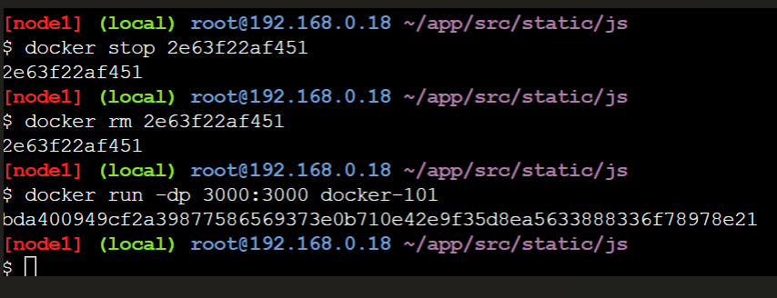
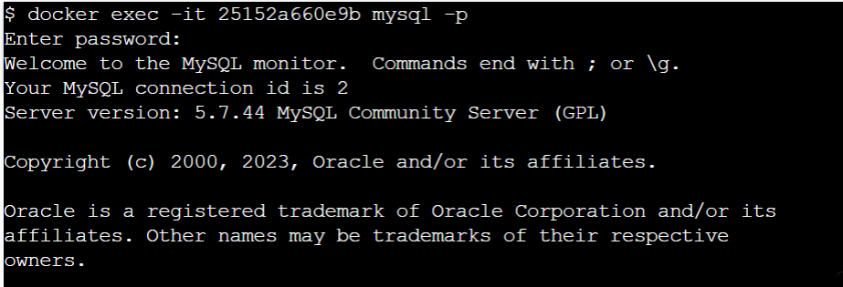
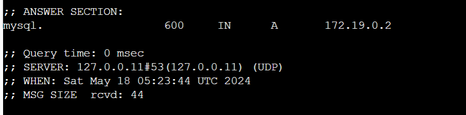

# Tugas 7

## Getting Started

1. Masuk ke halaman ``https://labs.play-with-docker.com/`` 
2. Ketikkan perintahh pada terminal ``docker run -dp 80:80 docker/getting-started:pwd``, lalu tunggu hingga kontaider dimulai dan klik port 80
   

## Our Application

1. Download zip yang telah disediakan
2. Lakukan unzip file dengan perintah ``unzip app.zip``
   
3. Pindah ke direktori app/
4. lihat isi dari direktori app
   
5. Untuk membangun aplikasi, buat file Dockerfile dengan perintah ``vi Dockerfile`` yang berisi:
    ```
    FROM node:10-alpine
    WORKDIR /app
    COPY . .
    RUN yarn install --production
    CMD ["node", "/app/src/index.js"]
    ```
    
6. Lakukan build container dengan perintah ``docker build -t docker-101 . `` dan jalankan menggunakan perintah ``docker run -dp 3000:3000 docker-101``
   
   
7. Buka port 3000 
   
8. Tambahkan beberapa tugas
   

## Updating Our App
1. Ubah/update source coide di fil ``~/app/src/static/js/app.js`` pada line 56
   
   
2. Lakukan update image menggunakan perintah ``docker build -t docker-101 .`` dan jalankan container baru menggunakan perintah ``docker run -dp 3000:3000 docker-101``
   
   
Saat mencoba menjalankan akan terjadi masalah, karena port 3000 dari host sudah digunakan. Untuk memperbaikinya, perlu menghapus port 3000.
3. Mengganti container lama ke container baru, jalankan perintah ``docker ps`` untuk melihat id container, stop container dengan perintah ``docker stop <the-container-id>``, remove container menggunakan perintah ``docker rm <the-container-id>``, lalu jalankan lagi perintah ``docker run -dp 3000:3000 docker-101``
   
   
   

## Sharing Our App

1. Buat repositori di Docker Hub 
   
2. Lakukan pushing img dengan perintah ``docker push dockersamples/101-todo-app``, namun akan terjadi error karena tidak menemukan gambar dengan nama dockersamples/101-todo-app.
   
3. Login ke docker hub dengan menggunakan perintah ``docker login -u YOUR-USER-NAME``
   
4. Gunakan perintah tag docker untuk memberi nama baru pada gambar docker-101 menggunakan perintah ``docker tag docker-101 YOUR-USER-NAME/101-todo-app`` dan lakukan push lagi ``docker push YOUR-USER-NAME/101-todo-app``
   
5. Jalankan image di new instance, namun sebelumnya wajib untuk menghapus instance lama dan menjalankan instance baru menggunakan perintah ``docker run -dp 3000:3000 YOUR-USER-NAME/101-todo-app``
   

## Persisting Our DB
1. Mulai sebuah kontainer ubuntu yang akan membuat sebuah file bernama /data.txt dengan nomor acak antara 1 dan 10000 dengan perintah ``docker run -d ubuntu bash -c "shuf -i 1-10000 -n 1 -o /data.txt && tail -f /dev/null"``
   
2. Melihat output dengan masuk ke dalam container, menggunakan perintah ``docker exec <container-id> cat /data.txt``
   
3. Jalankan container ubuntu menggunakan perintah ``docker run -it ubuntu ls /``
   
4. Buat volume menggunakan docker volume menggunakan perintah ``docker volume create todo-db``
   
5. Jalankan todo container menggunakan perintah ``docker run -dp 3000:3000 -v todo-db:/etc/todos docker-101``
   
6. Hapus container todo app menggunakan perintah ``docker rm -f <id>``
   
7. Untuk melakukan pengecekkan penyimpanan data di Docker dapat menggunakan docker volume inspect ``docker volume inspect todo-db``
   

## Using Bind Mounts
1. Pastikan bahwa tidak ada container docker-101 yang berjalan
2. Jalankan perintah ``docker run -dp 3000:3000 \ -w /app -v $PWD:/app \ node:10-alpine \ sh -c "yarn install && yarn run dev"``
    
3. Gunakan perintah ``docker logs -f <container-id>`` untuk melihat log
   
   
4. Buat perubahan pada aplikasi di file src/static/js/app.js, yaitu merubah tombol "Add Item" menjadi hanya "add". Perubahan ini akan ada di baris 109. Lalu jalankan menggunakan perintah ``docker build -t docker-101 .``
   
   
   

## Multi Container App
1. Membuat jaringan yang akan melampirkan container MySql saat startup, pertama membuat network ``docker network create todo-app``, lalu jalankan menggunakan perintah
   ```
   docker run -d \
    --network todo-app --network-alias mysql \
    -v todo-mysql-data:/var/lib/mysql \
    -e MYSQL_ROOT_PASSWORD=secret \
    -e MYSQL_DATABASE=todos \
    mysql:5.7
    ```
    
    
2. Untuk memastikan bahwa database kita sudah berjalan, hubungkan ke database dan verifikasi koneksi mengunakan perintah ``docker exec -it <mysql-container-id> mysql -p``
   
3. Masukkan password "secret" , masukkan perintah ``SHOW DATABASES:`` untuk melihat isi database
   
4. Melakukan koneksi ke MySQL, pertama tama Mulai kontainer baru menggunakan gambar nicolaka/netshoot menggunakan perintah ``docker run -it --network todo-app nicolaka/netshoot``. Pastikan untuk menghubungkannya ke jaringan yang sama.
   
5. Gunakan perintah dig untuk mencari alamt ip untuk nama host mysql menggunakan perintah ``dig mysql``
   
   
6. Jalankan app yang terhubung dengan MySql, Kita akan menentukan setiap variabel lingkungan di atas, serta menghubungkan kontainer ke jaringan aplikasi kita menggunakan perintah
   ```
   docker run -dp 3000:3000 \
   -w /app -v $PWD:/app \
   --network todo-app \
   -e MYSQL_HOST=mysql \
   -e MYSQL_USER=root \
   -e MYSQL_PASSWORD=secret \
   -e MYSQL_DB=todos \
   node:10-alpine \
   sh -c "yarn install && yarn run dev"
   ```
   
7. Menggunakan perintah ``docker logs <container-id>`` untuk melihat pesan yang menunjukkan bahwa itu menggunakan database MySql
   
   
8. Buka aplikasi todo app dan tambahkan beberapa todolist, lalu tampilkan table menggunakan perintah `` select * from todo_items;``
   
   

## Using Docker Compose

1. Install docker compose menggunakan perintah ``docker-compose version``
2. Membuat file compose dengan nama ``docker-compose.yml``, tambahkan untuk webservernya
   ```
       version: "3.7"

   services:
   app:
     image: node:10-alpine
     command: sh -c "yarn install && yarn run dev"
     ports:
     - 3000:3000
     working_dir: /app
     volumes:
     - ./:/app
     environment:
     MYSQL_HOST: mysql
     MYSQL_USER: root
     MYSQL_PASSWORD: secret
     MYSQL_DB: todos
   ```
3. Tambahkan service Database untuk mysql
   ```
      mysql:
      image: mysql:5.7
      volumes:
         - todo-mysql-data:/var/lib/mysql
      environment: 
         MYSQL_ROOT_PASSWORD: secret
         MYSQL_DATABASE: todos
   ```
4. Tambahkan volumes
   ```
   volumes:
     todo-mysql-data:
   ```
5. Lakukan compose up dengan menggunakan perintah `` docker compose up -d``
6. Cek logs

## Image Building Best Practice
1. Gunakan perintah ``docker image history`` untuk melihat lapisan-lapisan dalam gambar docker-101 yang telah dibuat sebelumnya
   
2. Layer Caching, update Dockerfile di package .json, lalu build kembali menggunakan perintah ``docker build -t docker-101 .``
   ```
   FROM node:10-alpine
   WORKDIR /app
   COPY package.json yarn.lock ./
   RUN yarn install --production
   COPY . .
   CMD ["node", "/app/src/index.js"]
   ```
    
3. Merubah file index.html ``src/static/index.html`` (like change the  to say "The Awesome Todo App").
   
   
5. Multi Stage Builds
   Maven/Tomcat Example
      ```
      FROM maven AS build
      WORKDIR /app
      COPY . .
      RUN mvn package

      FROM tomcat
      COPY --from=build /app/target/file.war /usr/local/tomcat/webapps 
      ```
   React
      ```
      FROM node:10 AS build
      WORKDIR /app
      COPY package* yarn.lock ./
      RUN yarn install
      COPY public ./public
      COPY src ./src
      RUN yarn run build

      FROM nginx:alpine
      COPY --from=build /app/build usr/share/nginx/html
      ```

